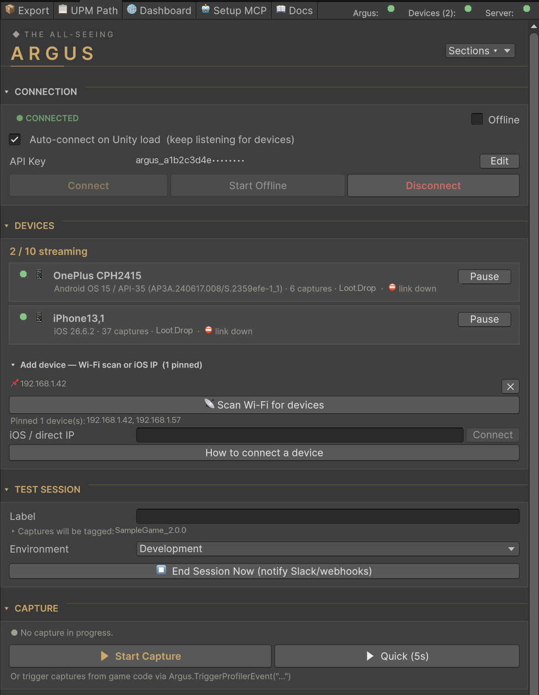
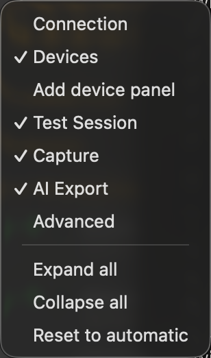
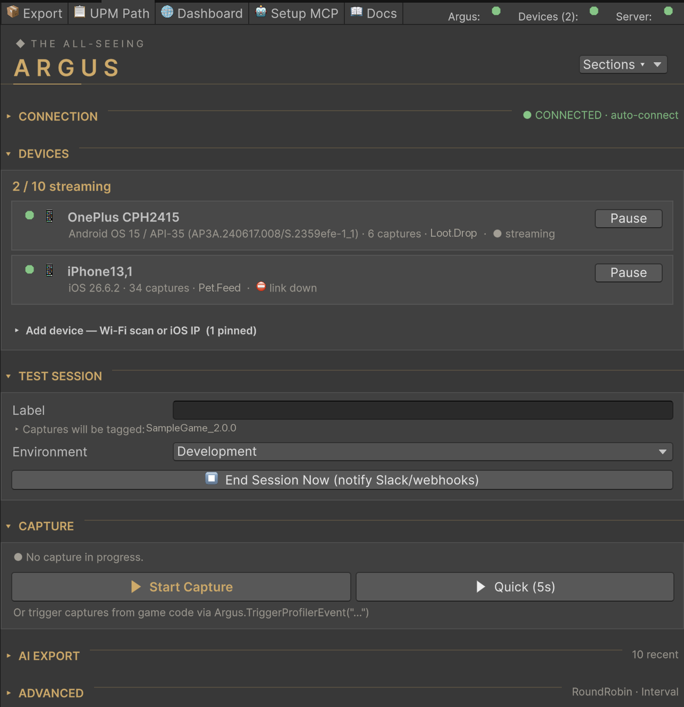
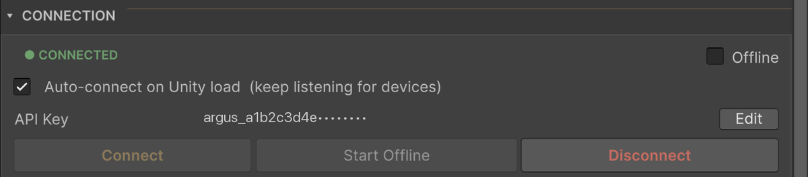
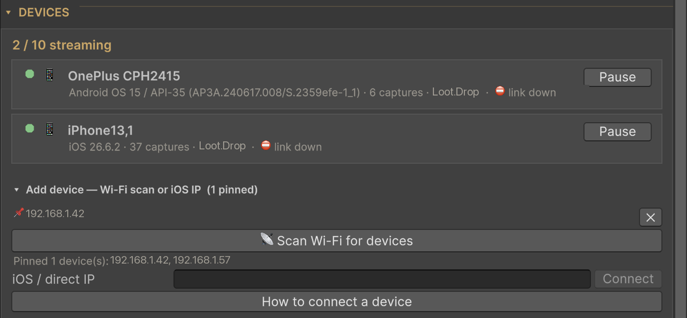
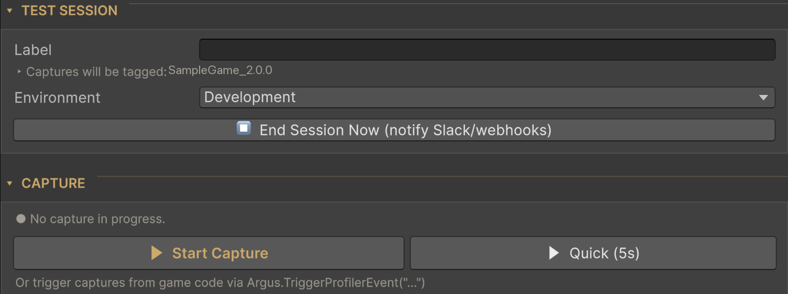
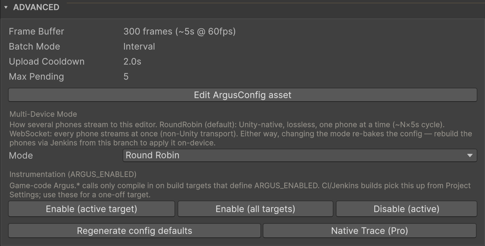
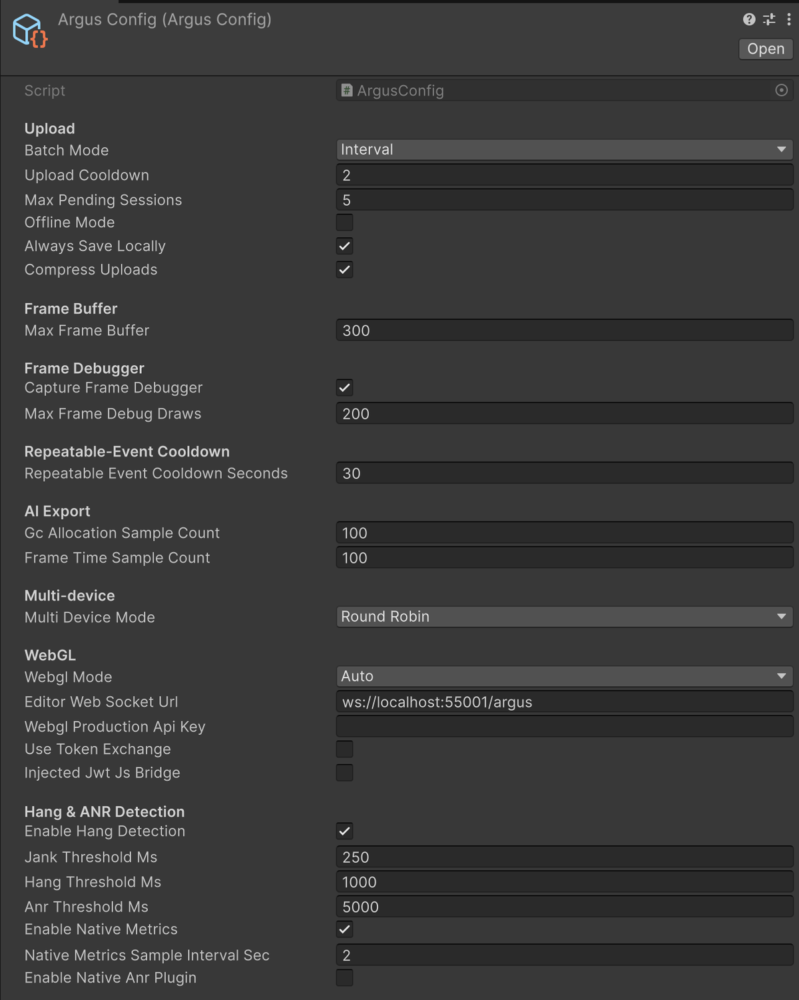
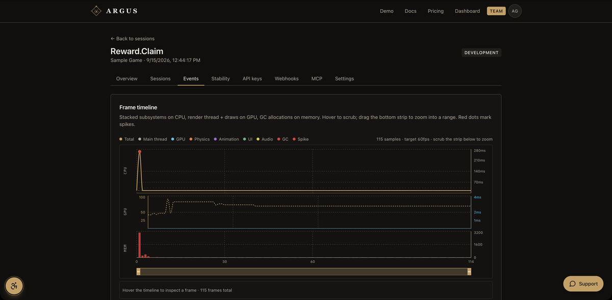

# Argus Profiler · `com.argus-profiler.unity`

Production performance profiling for Unity games. Captures per-frame data, code-region attribution, and device context from your Editor and development builds, streams them to the Editor, and uploads to the [Argus dashboard](https://argus-profiler.com) for visualisation, regression alerts, and AI-assisted optimisation reports.

> **About this repo** — DLL distribution only. The Unity package source lives in the operator's private workspace; this repo carries the compiled assemblies + UPM manifest each release tag points at. See [SECURITY.md](SECURITY.md) for the rationale.

---

## Install

### Via Git URL (recommended)

**Window → Package Manager → + → Add package from git URL**, paste:

```
https://github.com/Raspination/argus-unity-release.git#v2.4.0
```

(Omitting the `#v...` tag suffix tracks `main` and picks up future versions on **Window → Package Manager → Refresh**.)

To pin the version for a whole team, add it to `Packages/manifest.json` instead:

```json
"com.argus-profiler.unity": "https://github.com/Raspination/argus-unity-release.git#v2.4.0"
```

### Via .unitypackage

Every release also attaches `argus-profiler-<version>.unitypackage` under [Releases](https://github.com/Raspination/argus-unity-release/releases) — import it with **Assets → Import Package → Custom Package…**.

### Via the Unity Asset Store

An Asset Store listing is planned; once live, **Window → Package Manager → My Assets** installs and updates Argus like any other asset.

### Dependencies

None. Argus ships as compiled assemblies — `Argus.Runtime.dll`, `Argus.Editor.dll`, and small per-platform `Argus.Platform.Android|iOS|WebGL.dll` files under `Runtime/Platform/` that Unity includes only for that build target — and needs nothing beyond Unity itself. A `link.xml` is included so IL2CPP managed stripping never removes the runtime.

### Unity version

Every Unity 6 edition: the assemblies are built with `6000.0` LTS and load unchanged in `6000.1`, `6000.2`, `6000.3` and later. Unity 2022 and older are not supported.

---

## Enable Argus in your build

Argus's public API is gated by the **`ARGUS_ENABLED`** scripting define — opt-in by design so release builds carry zero overhead. Until the define is set, **no profiling data is captured**, and because the transport layer isn't gated, a connected device still shows as connected while sending nothing. So on first import Argus shows an **"Enable Argus for &lt;platform&gt; now?"** dialog (**Enable now** / **Not now**), and logs a console warning once per Editor session until the active build target has the define.

Enable via any of:

- **Tools → Argus Control → Advanced → Instrumentation (ARGUS_ENABLED)**:
  - **Enable (active target)** — adds `ARGUS_ENABLED` to the active build target
  - **Enable (all targets)** — Standalone / Android / iOS / WebGL / tvOS / VisionOS / WSA at once
  - **Disable (active)** — removes it from the active target
- **Project Settings → Player → Other Settings → Scripting Define Symbols** — add `ARGUS_ENABLED` manually per platform (this is also what CI builds pick up)

**The define is per build target.** If you switch platforms (e.g. Standalone → Android), enable it for the new target too.

With the define absent, every `TriggerProfilerEvent` / `BeginRegion` / `EndRegion` call is compile-stripped at the call site — no runtime cost, no string interpolation in your hot paths. `Region(...)` and `SuppressHangDetection()` return value-typed no-op scopes.

---

## Connect to the dashboard

1. **Sign up** at <https://argus-profiler.com/signup>. A personal organisation is created automatically.
2. **Create a project** from the dashboard and open its **API keys** tab.
3. **Issue a new key** with the `sessions:write` permission. The cleartext value is shown **once** — copy it now (format `argus_` + 32 hex chars).
4. In Unity open **Tools → Argus Control**. In the **Connection** card click **Edit**, paste the key, click **Save** (the key is validated immediately), then click **Connect**. The status pill flips to **● CONNECTED**.

The console names the destination on success (`API key valid — uploading to project '…' (org '…')`), so a key for the wrong project is visible straight away. Only an HTTP 401/403 rejects a key; if the dashboard is unreachable (network error, 5xx, 408, 429) the current state is kept and validation retries every 15 s, up to 8 times.

Until you have connected successfully at least once, the **Offline** toggle is disabled — there's no dashboard to be offline from yet. Every other section stays locked until you are connected or running offline.

---

## Argus Control window

The single hub for all in-Editor profiling controls: **Tools → Argus Control**.



### Toolbar

- **🌐 Dashboard** — opens the dashboard
- **🤖 Setup MCP** — menu: *Open MCP setup page on Dashboard*, *Copy sample Claude Desktop config*, *Reveal claude_desktop_config.json in Finder*
- **📖 Docs** — opens the quickstart
- Status dots on the right: **Argus** (running), **Device** / **Devices (N)** (streaming), **Server** (authenticated). Hover for details.

### Sections and folding

Every section header is clickable and collapses the card to a one-line summary (e.g. `● CONNECTED · auto-connect`, `1 / 2 streaming`, `idle`). The **Sections ▾** button in the header — or a right-click on any section header — opens a menu to show or hide each section, plus **Expand all**, **Collapse all**, and **Reset to automatic**.



By default sections follow the current state:

- **Connection** collapses once you are connected (or running offline) and reopens when you disconnect. It is always open while Argus is locked, after an authentication error, or while you are editing the API key.
- **Add device** panel is open while no device is streaming and collapses once one is.
- **Advanced** starts collapsed.

A manual expand or collapse is remembered (including across Editor restarts) until the state that drove the default changes. **Reset to automatic** clears all manual choices.



### Connection



- **Status pill** — **● CONNECTED** (key validated), **● OFFLINE** (offline mode on), **● ERROR** (last validation failed — the error is shown under the key), **○ NOT CONNECTED**
- **Offline** — skip dashboard uploads; captures still save to local JSON. Enabled only after your first successful connect.
- **Auto-connect on Unity load** — keeps Argus listening for devices: it starts now and restarts itself after recompiles, entering Play mode, and Editor restarts. Off: Argus runs only while you have connected manually. Never auto-starts in batch mode.
- **API Key** — shown masked. **Edit** → **Save** / **Cancel**; nothing is stored until you click Save.
- **Connect** / **Start Offline** / **Disconnect**

### Devices



A live list of every device streaming to this Editor. **Each device becomes its own test session**, tagged with its model, so you can run the same test on several devices and compare them on the dashboard.

- **`N / cap streaming`** — how many devices may stream at once is a plan limit (**Free 1 · Indie 2 · Pro 5 · Team 10 · Enterprise ∞**). At the cap an **Upgrade ↗** button appears and extra devices show *Paused — plan limit*. This dev-time cap does **not** apply to production direct uploads.
- **Device rows** — model, OS, capture count, last event, and liveness: **● streaming** (payload in the last 30 s), **idle Ns / Nm**, or **⛔ link down**. **Pause** frees a slot; **Activate** resumes a paused device. The list grows to three rows, then scrolls.
- **Add device — Wi-Fi scan or iOS IP**
  - **📡 Scan Wi-Fi for devices** — sweeps the local /24 for running development players (ports 55000–55003, a few seconds) and pins what it finds
  - Pinned IPs (**📌**, **✕** to unpin) — persisted per machine; a pinned device joins the rotation only while its player answers
  - **iOS / direct IP** + **Connect** — the phone's Wi-Fi IP (Settings → Wi-Fi → ⓘ)
  - **How to connect a device** — opens the docs

### Test Session

- **Label** — groups captures into one test-session rollup (applies to every connected device). Leave blank for the auto label `{ProductName}_{yyyy-MM-dd_HH-mm-ss}`; the line under the field shows what captures will be tagged with.
- **Environment** — Development / Staging / Production / Testing / Custom
- **⏹ End Session Now (notify Slack/webhooks)** — flushes pending uploads, closes the session on the dashboard (fires `test_session.completed`), and starts a new session instance

Changing the label also closes the previous session and starts a new instance.

### Capture



- **▶ Start Capture** — starts a manual capture that runs until **⏹ End Capture**
- **▶ Quick (5s)** — a 5-second capture
- Or trigger captures from game code (see [Capture an event](#capture-an-event))

Capture controls need Argus running (Connect or Start Offline).

### AI Export

- **📋 Copy Last Export** — copies the latest `_ai.json` to the clipboard (the saved path is shown below the button)
- **📁 Open Captures Folder** — reveals `ArgusCaptures/` (see [Local files](#local-files-and-logs))
- **Recent captures** — the last 10 AI exports with size, a 📋 copy button each, and **↻ Refresh**

### Advanced



- Read-only readout of the active **Frame Buffer**, **Batch Mode**, and (Interval mode) **Upload Cooldown** / **Max Pending**
- **Edit ArgusConfig asset** — selects the config asset
- **Multi-Device Mode** — **RoundRobin** (default) or **WebSocket**; see [Multiple devices](#multiple-devices). Changing it saves the asset — rebuild your device builds to apply it on-device.
- **Instrumentation (ARGUS_ENABLED)** — **Enable (active target)**, **Enable (all targets)**, **Disable (active)**
- **Regenerate config defaults** — only meaningful in the Argus source project; DLL installs configure via `Resources/ArgusConfig` instead
- **Native Trace (Pro)** — opens the native desktop-trace window (Xcode Instruments `xctrace` / Android `perfetto`)

---

## Connect devices

Build a **Development Build** with `ARGUS_ENABLED` defined for that target, with the Editor running and Argus connected (or Auto-connect on).

### Android

**Build & Run** with **Autoconnect Profiler** ticked. The device appears in the Devices card automatically.

### iOS

iOS Local Network privacy stops an iPhone from announcing itself to the Editor, so the Editor dials the phone instead — inbound connections need no permission:

1. Put the phone and the computer on the same Wi-Fi.
2. Launch the development build.
3. In **Devices → Add device**, click **📡 Scan Wi-Fi for devices**, or enter the phone's IP in **iOS / direct IP** and click **Connect**.

For development builds Argus adds `NSLocalNetworkUsageDescription` and `NSBonjourServices` (`_unityprofiler._tcp`) to `Info.plist` automatically, including CI builds that pass `BuildOptions.Development`. When `enableNativeAnrPlugin` is on, the iOS native plugin links the **MetricKit** framework to recover OS hang diagnostics on the next launch.

### WebGL

In the Editor a WebGL build streams over the local bridge at `ws://localhost:55001/argus`. For production builds see `webglMode` and `webglProductionApiKey` under [Configuration](#configuration).

### Multiple devices

Connect several devices at once — Android and iOS builds, and/or multiple WebGL tabs. **Multi-Device Mode** (Advanced, or `multiDeviceMode` on the config asset) chooses how native devices share the Editor:

- **RoundRobin** (default) — Unity's own PlayerConnection. The Editor cycles its profiler connection across devices, one at a time; each device keeps its captures until the Editor confirms them, so nothing is lost between turns. A single device is never cut.
- **WebSocket** — every device streams at the same time over Argus's own transport.

The mode is baked into the build, so pick it before building your devices.

### Device session lifecycle

- Each app launch is its own session instance on the dashboard.
- When the app quits, its session closes within about 30 s (immediately if the goodbye message reaches the Editor).
- Backgrounding and resuming the same app process continues the same session.
- A device that stays silent for 10 minutes is removed and its session closed.

---

## Capture an event

Three patterns, ordered by how often you'll use them. All are compile-stripped when `ARGUS_ENABLED` is absent. The type is `Argus.Argus` (class `Argus` in namespace `Argus`); spell it out as below, or `global::Argus.Argus` inside a namespace that has its own `Argus`.

### Per-instance captures (the common case)

One capture per `(eventName, uniqueId)` pair per run. The same `uniqueId` twice in the same run is silently dropped — keeps your dashboard from drowning in 12 identical "Order.Complete" rows when the player completes 12 sandwich orders.

```csharp
Argus.Argus.TriggerProfilerEvent("Order.Complete",
    duration: 3,
    uniqueId: orderConfig.DisplayName);

Argus.Argus.TriggerProfilerEvent("Chapter.Start", 4,
    uniqueId: chapter.DisplayName);
```

`tag:` is a display label shown next to the event name. When no `uniqueId` is passed, the tag is also the dedup key — one capture per distinct tag per run.

### Per-kind captures (one shot per run)

Omit `uniqueId` when one capture per event KIND is enough — boot, scene load, things that happen at most once per playtest anyway.

```csharp
Argus.Argus.TriggerProfilerEvent("Boot.Start", 6);
Argus.Argus.TriggerProfilerEvent($"Scene.Load.{sceneId}", 4);
```

### Bypass dedup (regression hunting)

When you want every fire to capture (A/B'ing two runs of the same code path, before/after profiling of a fix), pass `repeatable: true`. A per-name cooldown still applies as a fail-safe — see [`repeatableEventCooldownSeconds`](#configuration).

```csharp
Argus.Argus.TriggerProfilerEvent("BossFight.Frame", 3, repeatable: true);
```

### Wrap hot code paths so spikes get a label

```csharp
void Update() {
    Argus.Argus.BeginRegion("EnemyAI.Tick");
    foreach (var enemy in _enemies) enemy.Tick();
    Argus.Argus.EndRegion();
}

void Tick() {
    using var _ = Argus.Argus.Region("Pathfinding");
    DoExpensiveSearch();
}
```

Spikes during the region carry the **region chain** (e.g. `Battle > EnemyAI > Pathfinding`), the active scene, and the dominant subsystem to the dashboard. The dashboard's "Top region timings" card surfaces total ms + call count + avg + max per region.

### Silence the hang watchdog for known blocking work

```csharp
using (Argus.Argus.SuppressHangDetection())
{
    SceneManager.LoadScene("Battle");
}
```

Scopes nest; detection resumes when the outermost one is disposed.

---

## Configuration

Create the config asset via **Assets → Create → Argus → Configuration**.

**With this DLL package, save it as `Resources/ArgusConfig.asset`** (any `Resources/` folder, asset named `ArgusConfig`). At startup — in player builds and Editor Play mode — Argus loads `Resources/ArgusConfig` and applies it over the defaults compiled into `Argus.Runtime.dll`. Without it the defaults below apply. In the Editor, the **Offline** toggle in Argus Control wins over the asset's `offlineMode`.



| Field | Default | Description |
|---|---|---|
| `batchMode` | `Interval` | `Interval` uploads cooldown-bounded batches (live dashboard feedback, crash-resilient). `SessionEnd` holds every event and ships one batch when the session ends (lowest cost, no live feedback, a crash before the end loses the session). |
| `uploadCooldown` | `5` s | Minimum gap between batched uploads (`Interval` only). |
| `maxPendingSessions` | `20` | Upload immediately once this many events are queued (`Interval` only). |
| `offlineMode` | `false` | Skip dashboard uploads; captures still write to local JSON. In the Editor, use the Offline toggle instead. |
| `alwaysSaveLocally` | `true` | Local JSON backups are currently written for every capture regardless of this flag. |
| `compressUploads` | `true` | gzip the request body. 5–10× smaller on typical payloads. |
| `maxFrameBuffer` | `300` | Frames retained per capture (~5 s at 60 fps). |
| `captureFrameDebugger` | `true` | Snapshot Unity's Frame Debugger draw calls at the end of a capture (Editor only). |
| `maxFrameDebugDraws` | `200` | Cap on draw calls in that snapshot; the total count is reported regardless. |
| `repeatableEventCooldownSeconds` | `30` | Per-name cooldown for `repeatable: true` events. Values of 0 or below fall back to 30. |
| `gcAllocationSampleCount` / `frameTimeSampleCount` | `100` / `100` | Samples per curve in the `_ai.json` export. |
| `multiDeviceMode` | `RoundRobin` | `RoundRobin` or `WebSocket` — see [Multiple devices](#multiple-devices). Baked into the build. |
| `webglMode` | `Auto` | `Auto` tries the Editor bridge for ~2 s, then falls back to direct HTTPS upload if `webglProductionApiKey` is set. `EditorBridge` = bridge only. `DirectUpload` = HTTPS only. |
| `editorWebSocketUrl` | `ws://localhost:55001/argus` | Editor bridge address. Change only if you remapped the port. |
| `webglProductionApiKey` | `""` | Key baked into production WebGL builds. It is visible in the JS bundle — issue a `sessions:write`-only key with its platform set to WebGL. |
| `useTokenExchange` | `false` | WebGL: swap the baked key for a 15-minute JWT before uploading. |
| `injectedJwtJsBridge` | `false` | WebGL: read the JWT from `window.argusInjectedJwt` supplied by your own backend, so the bundle ships no long-lived key. Wins over `useTokenExchange`. |
| `enableHangDetection` | `true` | Main-thread hang/ANR watchdog (device/player builds only; inert in the Editor). |
| `jankThresholdMs` / `hangThresholdMs` / `anrThresholdMs` | `250` / `1000` / `5000` | Stall thresholds for each severity. |
| `enableNativeMetrics` | `true` | Sample thermal trend, native heap, and memory pressure below the managed layer. |
| `nativeMetricsSampleIntervalSec` | `2` | Native-metrics sample cadence (seconds). |
| `enableNativeAnrPlugin` | `false` | Opt in to OS ground-truth ANRs (Android `ApplicationExitInfo` API 30+ / iOS MetricKit), recovered on the next launch. Uses the plugins under `Native/Plugins/`. |

> **Plan gating.** These flags are the *capture* switches; whether the data is
> kept depends on your dashboard plan (per-frame timeline / attribution /
> context are Indie+, hangs + native metrics + Frame Debugger + traces are
> Pro+). Argus reads your plan's entitlements when the key validates and skips
> capturing what isn't included — the server strips it on upload regardless — so
> leaving a flag on under a lower plan is harmless.

---

## Uploads and reliability

- Uploads that fail transiently (network error, 5xx, 408, 429) retry after 3, 10, 30, 60 and 120 s — enough to ride out a backend restart.
- HTTP 401/403 marks the key invalid and signs you out; other 4xx responses are logged with the server's reason and not retried.
- If every retry fails, the console says so; the capture is still on disk in `ArgusCaptures/`.
- With **Offline** on, captures are saved locally and not uploaded — unticking Offline later does not upload them. A warning is logged once per domain reload.

---

## What ships in each capture

| Bucket | Fields |
|---|---|
| **Frame timing** | `frameTimes[]`, `frameTimesCPU[]`, `frameTimesGPU[]`, averages + percentiles |
| **Rendering** | `drawCalls[]`, `batches[]`, `triangles[]` per frame |
| **Subsystem ms** | per-frame `physicsMs`, `animationMs`, `uiMs`, `audioMs` |
| **GC** | `gcAllocPerFrameBytes[]` |
| **Spikes** | Top-10 list with `frameIndex`, `deltaMs`, `regionChain`, `scene`, `dominant`, per-thread + subsystem ms breakdown |
| **Region timings** | Per-region `callCount`, `totalMs`, `maxMs`, `avgMs` |
| **Hangs / ANRs** | `anrs[]` with severity, stall length, region chain, scene, source (watchdog or OS) |
| **Native metrics** | thermal trend, native heap, available memory, memory pressure |
| **Asset memory** | `meshMemoryMB`, `textureMemoryMB` |
| **Scene context** | `activeScene`, all loaded scenes, counts of `Camera` / `Light` / `Renderer` / `ParticleSystem` / `AudioSource` / active GameObjects |
| **Run context** | git SHA (when available), scripting backend, build target, debug-build flag, quality preset + render scale + MSAA + shadow distance, display resolution + refresh rate + DPI, mobile thermal state + battery, network reachability |
| **Device fingerprint** | model, OS, GPU, RAM, app version, Unity version |



---

## Local files and logs

Everything is written to `ArgusCaptures/` under the Editor's `Application.persistentDataPath` (macOS: `~/Library/Application Support/<Company>/<Product>/ArgusCaptures`). **AI Export → Open Captures Folder** opens it.

| File | Contents |
|---|---|
| `{eventName}_{timestamp}.json` | Full capture — same shape as the dashboard upload |
| `{eventName}_{timestamp}_ai.json` | LLM-optimised dense format — sampled curves, top spikes, region timings, run context |
| `run_{timestamp}.json` / `run_{timestamp}.md` | Run digest, written when Argus stops |
| `connections_{timestamp}.log` | Connect / disconnect / rotation journal for that run |
| `argus-editor.log` | Every `[Argus]` console line (errors with their first stack frame), trimmed at 2 MB |

---

## AI analysis (Claude / ChatGPT / Cursor / Cline / Aider / any LLM agent)

The `_ai.json` is vendor-neutral JSON. Copy it with **AI Export → 📋 Copy Last Export** (or pick one from **Recent captures**) and paste it into any agent with a prompt like:

> "Analyse this Unity profiling capture and suggest the top 3 optimisations. Cite specific frame indices and region names from the data."

### Claude Code integration (optional)

The package includes a Claude Code plugin marketplace (`.claude-plugin/marketplace.json`, marketplace `argus-local`, plugin `argus`). Add the package folder as a marketplace, then install:

```
/plugin marketplace add <path-to-the-installed-package>
/plugin install argus@argus-local
```

| Command | Purpose |
|---|---|
| `/argus:latest` | Summary + optimisation suggestions for the most recent capture |
| `/argus:verify` | Sanity-checks captures: device vs Editor data, instrumentation gaps, dedup |
| `/argus:compare <a> <b>` | Diff two captures; flags quality-preset mismatch, scene-content changes, region-timing regressions |

### Dashboard analyses via MCP

**🤖 Setup MCP** in the toolbar connects your local Claude (Desktop or Code) to the dashboard: open the MCP setup page to generate a key and config snippet, or copy a sample Claude Desktop config and paste it into `claude_desktop_config.json`. Analyses run on your own Claude subscription.

---

## Common workflows

### Capture from the Editor without game code

**Tools → Argus Control → Capture → ▶ Start Capture**, then **⏹ End Capture** when done — or **▶ Quick (5s)**. The capture is tagged with the current Test Session label.

### Local-only captures for travel

After you've connected at least once, tick **Offline** in the Connection card, then **Start Offline**. Captures land in `ArgusCaptures/` as JSON and are not uploaded.

### A device doesn't show up

- Confirm it is a Development Build with `ARGUS_ENABLED` defined for that target.
- Android: rebuild with **Autoconnect Profiler**. iOS: use **Scan Wi-Fi for devices** or the phone's IP.
- Check the Editor is running Argus (toolbar **Argus** dot green) — turn on **Auto-connect on Unity load** so it survives recompiles.
- Read `connections_*.log` and `argus-editor.log` in `ArgusCaptures/`.

---

## Versioning + upgrades

This package follows semantic versioning. Patch bumps (`2.0.x → 2.0.y`) are non-breaking — bump the `#v...` tag in your `Packages/manifest.json` (or update from **My Assets** once installed from the Asset Store) and Unity refreshes the import on next reload.

Browse tags at [github.com/Raspination/argus-unity-release/tags](https://github.com/Raspination/argus-unity-release/tags). Release notes are in [`CHANGELOG.md`](CHANGELOG.md).

---

## Links

| | |
|---|---|
| Dashboard | <https://argus-profiler.com> |
| Quickstart docs | <https://argus-profiler.com/docs/quickstart> |
| Unity package docs | <https://argus-profiler.com/docs/unity> |
| Webhooks docs | <https://argus-profiler.com/docs/webhooks> |
| Account / API keys | <https://argus-profiler.com/docs/account> |
| Issue tracker | <https://github.com/Raspination/argus-unity-release/issues> |
| Support email | <support@argus-profiler.com> |
| Accessibility | <https://argus-profiler.com/legal/accessibility> |

---

## License

See [LICENSE.txt](LICENSE.txt). All rights reserved. Commercial use of the dashboard service is governed by the [Terms of Service](https://argus-profiler.com/legal/terms). Redistribution of the compiled assemblies in this repository requires written permission.
